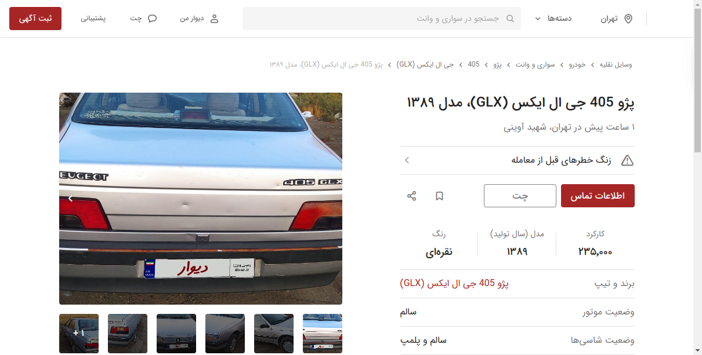

# Test_Divar_Web_Select_Vehicle

This repository demonstrates a process for select special vehicle from Divar Webcite by appliying Selenium in python3.10.
this Code consists of multi actions alluded in below:
1) select vehicle category
2) select special vehicle such as car
3) select intended use of vehicle
4) apply three filter for instance color, Maximum price and minimum kilometrage
5) apply cheapest filter after all of them
6) ultimately, choose random advertising car shown
7) selenium will take screenshot from result of this process for correctness executing code.This image is available as result.png.

## Steps to run the tests by using terminal 

- Install the requirements
    - pip install -r requirements.txt
- Run the tests
    - cd /snap_food_project
    - python -m pytest test_Divar_Web_search_Vehicle.py
- View the test results as image in /snap_food_project
    - result.png
    - 

## Steps to run the tests in Docker

**Prerequisites**:

- Docker

**Steps**:

- Build the Docker image
    - `docker build -t test_some_module -f Dockerfile .`
- Create a container instance of that image (which will run the entrypoint)
    - `docker run -it --name test_some_module test_some_module`
- Copy out the test results
    - `docker cp test_some_module:/srv/test_results.xml ./test_results.xml`
- Remove the container instance
    - `docker rm -f test_some_module`
- View the test results (in JUnit XML)
    - `cat test_results/some_module_results.xml`

## Convenience scripts (for Docker approach)

- Build the Docker image
    - `./build.sh`
- Run the Docker image and extract the test results
    - `./run.sh`
