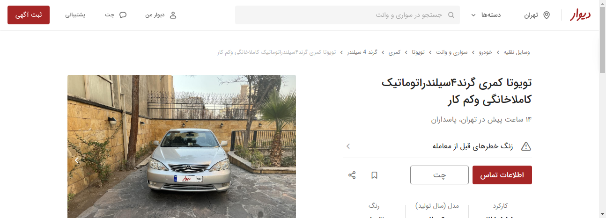

# Test_Divar_Web_Select_Vehicle

This repository demonstrates a process for selecting a special vehicle from the Divar Website by applying Selenium in **python3.10**.
this Code consists of multiple actions alluded to below:
1) select vehicle category
2) select a special vehicle such as a car
3) select the intended use of the vehicle
4) apply three filters for instance color, Maximum price, and minimum kilometrage
5) apply the cheapest filter after all of them
6) ultimately, choose a random advertising car shown
7) selenium will take screenshots from the result of this process for the correctness of executing code. This image is available as result.png.

## requirement
    webdriver-manager
    selenium 
    pytest
    
## Steps to run the tests by using the terminal 
1) active environment
- `python3 -m venv .snapfoodenv`
- `source .snapfoodenv/bin/activate`
2) Install the requirements
- `cd /snap_food_project/QA_Atomation`
- `pip3 install -r requirements.txt`
3) Run the tests
- `python3 -m pytest test_Divar_Web_search_Vehicle.py`
4) View the test results as an image and video in /out_put folder.
- `result.png`
-    
- `video`
-    

## Steps to run the tests in Docker

**Prerequisites**:

- Docker

**Steps**:

1) Build the Docker image
- `cd /snap_food_project/QA_Atomation`
- `docker build -t "test" -f Dockerfile .`
2) Create a container instance of that image (which will run the entrypoint)
- `docker run test`

## Convenience scripts (for Docker approach)

1) Build the Docker image
- `cd /snap_food_project/QA_Atomation`
- `./build.sh`
2) Run the Docker image and extract the test results
- `./run.sh`
